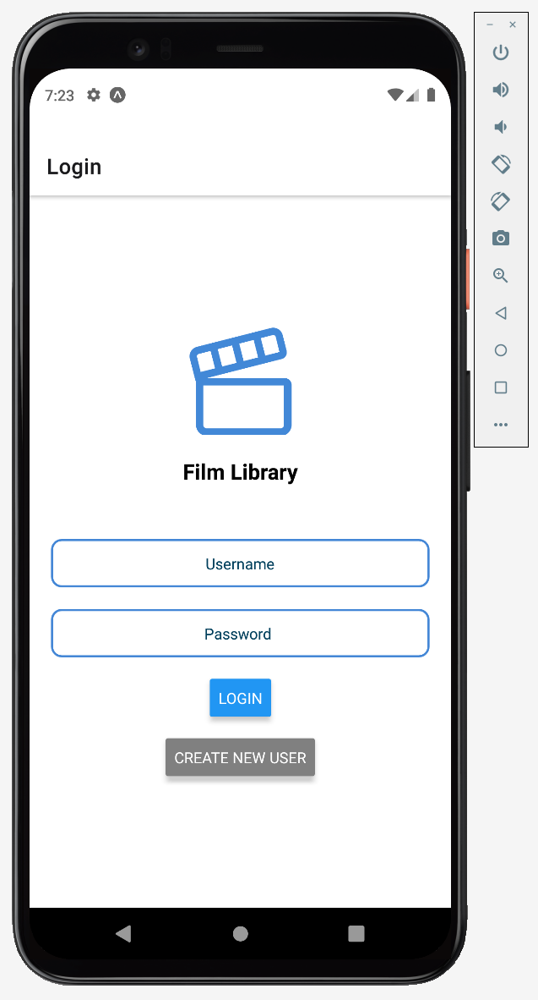

## SE572 - Final Project - Mobile App Guide

### Pre-requisites
- Download Android Studio, here: [Android Studio](https://developer.android.com/studio)
  - Once downloaded, install one of the Emulators using the AVD Manager. I recommend using the same as I used to see how to app looked during dev, the "Pixel 5" device emulator.
    
    
    
  - Make sure to also download Android Pie to use on the emulator
    
     
- Download the **Expo CLI**
  - Install via NPM: `npm install -g expo-cli`
  - If any issues are encountered, check out the site: [React Native Setup](https://reactnative.dev/docs/environment-setup)

### Starting it up
- Start the emulator up using the AVD Manager, and make sure it works properly and is completely started before moving on (Expo relies on it being started)
- Once it is started, `cd` into the se572-films-mobile-app folder, and just do `npm start`
  - It should start up Expo, opening in your browser
  - If something doesn't work, try doing `npm install` in the directory just in case a dependency is missing
- You can make it push the preview out to the Pixel emulator by either typing `a` in the console once Expo is started up...
  
    ...OR by clicking the 'Run on Android device/emulator' button on the web UI
  
- Expo should now launch on the emulator, and then compile and launch the mobile app, starting you on the Login page (of course, if the API is not running on your local network, the app will not work to log you in if you try)
    
